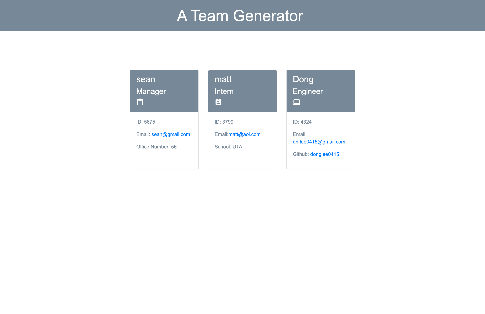

# A-Team-Generator
[](https://github.com/donglee0415/A-Team-Generator/issues) [](https://github.com/donglee0415/A-Team-Generator/graphs/contributors) 

## Description
This application was created to generate a team profile based on user input using the Inquirer module from Node.js and displaying the information on a newly created html page with a style sheet. 
            
View the deployed page at [Team Profile Generator](https://github.com/Donglee0415/A-team-generator).
## Contents
* [Installation](#installation)
* [Usage](#usage)
   * [Screenshots](#screenshots)
* [Built With](#built-with)
* [License](#license)
* [Contributing](#contributing)
* [Questions](#questions)
* [Credits](#credits)

## Installation
To use this application, please install: 
```
Npm inquirer
```
    
## Usage
To use this application please install: npm inquirer 
    
### Screenshots



## Built With

* HTML
* CSS
* SASS
* JavaScript
* Node.js
* Express.js
    
## License
This application is licensed under the MIT license.
    
## Contributing
Contributors should read the installation section.
    
## Questions
If you have any questions about the repo, please [open an issue](https://github.com/donglee0415/A-Team-Generator/issues) or contact me via email at dn.lee0415@gmail.com. You can find more of my work on my GitHub, [donglee0415](https://github.com/donglee0415/).

    
